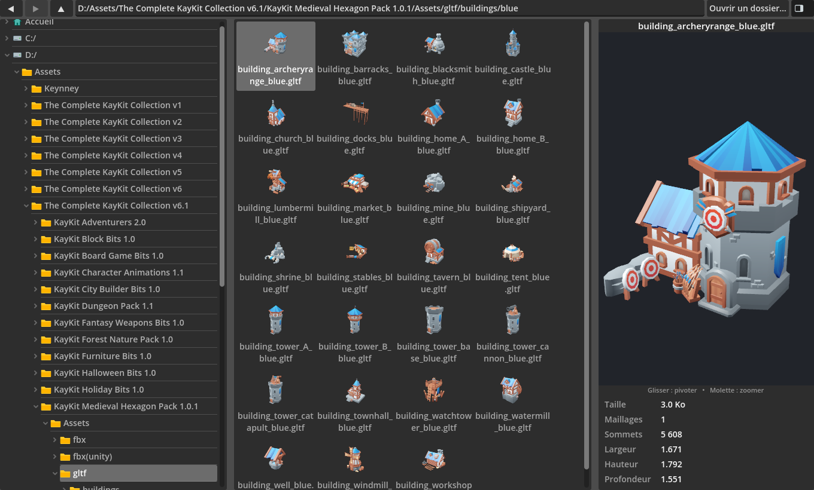

# 3D Assets Viewer

Un visualiseur d'assets 3D façon **explorateur Windows**, fait avec **Godot 4.7**. On pointe vers
n'importe quel dossier du disque, on navigue dans l'arborescence, et on prévisualise les modèles 3D
en temps réel — miniatures « brûlées » dans la grille et aperçu 3D orbital à droite.



## ✨ Fonctionnalités

- **Navigation type explorateur** : arbre de dossiers à gauche (Accueil + lecteurs), grille de fichiers
  au centre, volet d'aperçu 3D à droite. Barre d'outils Précédent / Suivant / Parent, champ de chemin,
  sélecteur de dossier natif, et bouton pour masquer l'aperçu.
- **Formats supportés au runtime** : `.glb`, `.gltf`, `.fbx` (moteur ufbx intégré, **FBX Unity compris**)
  et `.obj` (parseur maison avec matériaux `.mtl`).
- **Miniatures 3D** rendues hors-écran et **mises en cache sur disque** (`user://thumbnails/`) :
  générées une fois, instantanées ensuite.
- **Aperçu 3D interactif** : glisser pour pivoter, molette pour zoomer, cadrage caméra automatique, et un
  **tableau d'informations** (taille, maillages, sommets, dimensions).

## 🎮 Prise en main

1. Ouvrir **Godot 4.7** et importer `project.godot`.
2. Lancer la scène principale (**F5**).
3. Cliquer **« Ouvrir un dossier… »** et pointer vers un dossier contenant des modèles 3D.
4. Cliquer un fichier pour l'afficher à droite ; **glisser** pour pivoter, **molette** pour zoomer.

## 🧱 Structure

```
scenes/main.tscn        # racine minimale -> scripts/main.gd
scripts/
  main.gd               # barre d'outils, historique, navigation
  folder_tree.gd        # arbre de dossiers (volet gauche, lazy)
  asset_grid.gd         # grille de fichiers + miniatures
  model_preview.gd      # aperçu 3D orbital (volet droit)
  model_loader.gd       # chargement multi-format (glTF/FBX/OBJ)
  thumbnail_baker.gd    # rendu + cache des miniatures
icons/                  # icônes SVG (dossier, disque, accueil, modèle, aperçu)
theme.tres              # thème global (taille de police 14)
tests/                  # suite GdUnit4 (voir tests/README.md)
export_presets.cfg      # presets d'export Linux / Windows / macOS
```

## 🧪 Tests

Suite [GdUnit4](https://github.com/MikeSchulze/gdUnit4) headless (addon commité dans `addons/gdUnit4/`).

```powershell
pwsh tests/run.ps1
```

La CI ([`.github/workflows/tests.yml`](.github/workflows/tests.yml)) exécute la suite à chaque push/PR
sur `main`. Voir [`tests/README.md`](tests/README.md).

## 📦 Builds & versioning automatique

Le versioning suit les [**Conventional Commits**](https://www.conventionalcommits.org/) : **on ne
choisit jamais le numéro de version** — la pipeline le calcule à partir des messages de commit
(`fix:` → *patch*, `feat:` → *minor*, `feat!:`/`BREAKING CHANGE:` → *major*). Règle détaillée :
[`.claude/rules/conventional-commits.md`](.claude/rules/conventional-commits.md).

Flux ([`.github/workflows/release.yml`](.github/workflows/release.yml)) :

1. À chaque push sur `main`, **release-please** ouvre/actualise une **Release PR** qui contient le
   prochain numéro SemVer et le `CHANGELOG.md` générés depuis les commits.
2. Quand tu **fusionnes cette Release PR**, le tag `vX.Y.Z` et la **GitHub Release** sont créés.
3. [`build.yml`](.github/workflows/build.yml) (réutilisable) exporte alors **Linux**, **Windows**
   (cross-export depuis Ubuntu) et **macOS** (runner natif) en Godot 4.7 headless, et **attache les
   `.zip`** des trois plateformes à la Release.

> **Première version.** Le dépôt démarre à `0.0.0` : le premier `feat:` publiera `0.1.0`. Pour
> sortir directement en `1.0.0`, ajoute un footer `Release-As: 1.0.0` à un commit.

Le numéro de version est aussi injecté dans [`scripts/version.gd`](scripts/version.gd) (`AppVersion.VERSION`)
par release-please, et **affiché en bas de l'application dans la barre de statut** — aucune saisie manuelle.

**Prérequis (une seule fois)** : *Settings → Actions → General →* activer **« Allow GitHub Actions to
create and approve pull requests »** (sinon release-please ne peut pas ouvrir la Release PR).

Pour un build de test sans publier : onglet **Actions → build → Run workflow** (produit seulement les
artifacts).

### Durcissement recommandé (optionnel)

Empêcher de fusionner une Release PR (ou toute PR) dont les tests échouent — à lancer une fois que le
check **GdUnit4** a tourné au moins une fois sur une PR :

```bash
gh api -X PUT repos/guillaumedelre/3d-assets-viewer/branches/main/protection \
  -H "Accept: application/vnd.github+json" \
  -f 'required_status_checks[strict]=true' \
  -f 'required_status_checks[checks][][context]=GdUnit4' \
  -f 'enforce_admins=false' \
  -F 'required_pull_request_reviews=null' \
  -F 'restrictions=null'
```

## 🛠️ Prérequis

- **Godot 4.7** (les formats FBX/glTF/OBJ sont chargés à l'exécution, sans outil externe).
- Pour la CI/les builds : rien à installer localement — les workflows téléchargent Godot et les templates.
